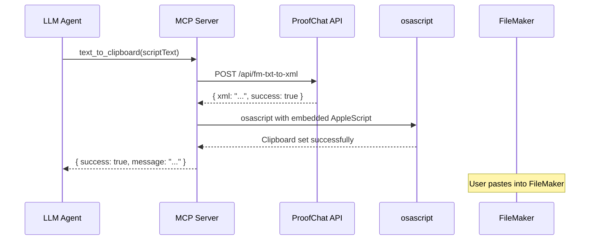

# FileMaker Script Clipboard Tool

## Overview

The `fmodata_text_to_clipboard` tool allows LLM agents to convert FileMaker script text into valid FileMaker XML and place it on the macOS clipboard as a native FileMaker object that can be pasted directly into FileMaker.

## Requirements

- **Platform**: macOS only (requires AppleScript)
- **Configuration**: ProofChat API credentials must be provided via MCP server configuration

## Configuration

The tool requires ProofChat API credentials to function. These can be provided in two ways:

### Option 1: MCP Server Configuration (Recommended)

When initializing the MCP server, pass the credentials in the config:

```typescript
import { createServer } from "fmodata-mcp";

const server = await createServer({
  host: "your-filemaker-server.com",
  database: "YourDatabase",
  username: "admin",
  password: "password",
  // ProofChat API credentials
  proofchatFmSecret: "your-fm-secret-here",
  proofchatLicenseKey: "your-license-key-here",
  proofchatActivationData: "your-activation-data-here",
  proofchatOpenAIKey: "your-openai-api-key-here",
});
```

### Option 2: Environment Variables (Fallback)

If not provided in the config, the server will fall back to environment variables:

```bash
export PROOFCHAT_FM_SECRET="your-fm-secret-here"
export PROOFCHAT_LICENSE_KEY="your-license-key-here"
export PROOFCHAT_ACTIVATION_DATA="your-activation-data-here"
export OPENAI_API_KEY="your-openai-api-key-here"
```

These credentials are required for the ProofChat API that converts text to FileMaker XML.

## How It Works



1. The LLM sends FileMaker script text to the tool
2. The MCP server calls the ProofChat API to convert text to FileMaker XML
3. The server executes AppleScript via `osascript` to place the XML on the clipboard as a FileMaker object
4. The user can now paste directly into FileMaker

## Example Usage

### Input (FileMaker Script Text)

```
# /##
# Purpose: Find all licenses with names containing "wireless"
# @returnSuccess Found set of licenses containing "wireless" in their names.
# #/

# === Initialize error handling ===
Set Error Capture [ On ]
Allow User Abort [ Off ]

# === Navigate to the layout where licenses are listed ===
Go to Layout [ "License List" ]

# === Enter find mode without pause ===
Enter Find Mode [ Pause: Off ]

# === Set field criteria for license name containing "wireless" ===
Set Field [ License::LicenseName; "*wireless*" ]

# === Perform the find ===
Perform Find [ ]

# === Handle find errors ===
If [ Get ( LastError ) ≠ 0 ]
    Show Custom Dialog [ "Find Error"; "No licenses found." ]
    Exit Script [ Text Result: "No records found" ]
End If
```

### Tool Call

```json
{
  "name": "fmodata_text_to_clipboard",
  "arguments": {
    "text": "# /##\n# Purpose: Find all licenses...\n"
  }
}
```

### Response

```json
{
  "success": true,
  "message": "FileMaker script has been converted to XML and placed on the clipboard. You can now paste it into FileMaker."
}
```

## Error Handling

The tool will return an error if:

- Missing environment variables
- Running on a non-macOS platform
- ProofChat API request fails
- AppleScript execution fails
- Invalid FileMaker XML returned from API

## Technical Details

### API Endpoint

The tool calls the ProofChat API at:
```
POST https://app.proofchat.ai/api/fm-txt-to-xml
```

### AppleScript

The tool uses an embedded AppleScript based on the `fmObjectTranslator` to convert XML to FileMaker objects. The script:

1. Validates the XML contains valid FileMaker objects
2. Converts the XML to the appropriate FileMaker clipboard data type (XMSS for script steps)
3. Sets the macOS clipboard with the FileMaker object

### FileMaker Object Types Supported

The AppleScript supports these FileMaker object types:
- Script Steps (XMSS)
- Layouts (XML2, XMLO)
- Scripts/Groups (XMSC)
- Fields (XMFD)
- Custom Functions (XMFN)
- Base Tables (XMTB)
- Value Lists (XMVL)

## Testing

To verify the tool is properly registered:

```javascript
import { createClipboardTools } from "./dist/tools/clipboard.js";

const mockConfig = {
  host: "localhost",
  database: "TestDB",
  proofchatFmSecret: "test-secret",
  proofchatLicenseKey: "test-key",
  proofchatActivationData: "test-data",
  proofchatOpenAIKey: "test-openai-key",
};

const tools = createClipboardTools(null, mockConfig);
console.log(tools); // Should show fmodata_text_to_clipboard
```

For full end-to-end testing, ensure:
1. All ProofChat credentials are configured
2. Running on macOS
3. FileMaker is installed and can receive clipboard data

